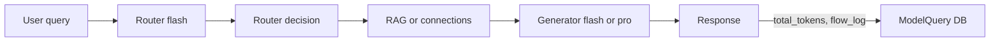

# Router system and usage

This document describes the 2-call router flow, how usage and tokens are saved, and the cost/savings design.

## Flow diagram

Each request runs **two LLM calls**: a cheap router (always gemini-3-flash-preview) and a generator (flash or pro based on the router). After the response is streamed, one row is written to `model_queries` with `total_tokens`, `duration_ms`, and `flow_log`.

## Router output

The router (Call 1) runs once per user message and returns a structured decision that drives the second call:

| Field | Description |
|-------|-------------|
| `reasoning` | Step-by-step analysis (Chain-of-Thought, output first so the model thinks before committing) |
| `needs_rag` | Whether to run RAG retrieval for this query |
| `tools_needed` | e.g. `["RAG"]`, `["RAG","Calculator"]`, or `[]` |
| `connections_needed` | e.g. `["google"]` for Gmail or `[]` |
| `model_to_use` | `gemini-3-flash-preview` or `gemini-3-pro-preview` for the generator |
| `complexity_score` | Optional 1–5 for model selection |

The pipeline uses this to: run RAG and/or connections if requested, pick the generator model (flash vs pro). Human-in-the-loop tasks are created only when the **generator** (Call 2) outputs the escalation token `[[ESCALATE_TO_HUMAN]]` in its final response—not from the router.

## Where usage is saved

Every completed chat (when `agent_id` is set and the database is configured) persists one row in the **`model_queries`** table with:

- **`total_tokens`** – Tokens used by the generator (and reflected in stream metrics)
- **`duration_ms`** – Wall-clock time for the generator stream
- **`method_used`** – EFFICIENCY or PERFORMANCE (derived from the chosen model)
- **`flow_log`** (JSONB) – Full request/response flow:
  - `request` – agent_id, user_query, user_query_len
  - `router_decision` – The router output above
  - `metrics` – call_count (2), router_model, generator_model, tools_executed, docs_retrieved, input_chars, response_chars, etc.

The **Stats** UI reads daily aggregates (queries, tokens, avg latency, avg quality) from this table. The **Queries** UI lists each model query and shows the expandable `flow_log` (router_decision + metrics) per row.

## Savings narrative

- **2-call design**: One small, cheap router call (gemini-3-flash-preview, ~50 tokens max) decides how to handle the query; then a single generator call (flash or pro) does the actual work. This avoids running a heavy model for every request.
- **Router is always flash**: The router is fixed to a fast, low-cost model so routing adds minimal latency and cost.
- **Generator is flash or pro per request**: The router chooses flash for simpler queries and pro for complex ones. Storing `flow_log` per query lets you analyze flash vs pro usage and token consumption over time.
- **Metrics**: Each response includes `call_count: 2` in the flow metrics. Tokens and flow details are stored for every query so you can measure usage and tune routing or prompts.
